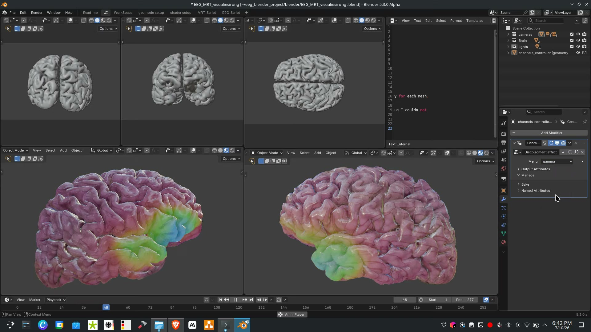

# EEG Blender Visualization

Real-time EEG brain activity visualization pipeline: EEG and MRI data are
processed in Python/MNE and rendered onto a 3D brain mesh in Blender.



## Project structure

```
notebooks/       Jupyter notebooks for EEG and MRI data harvesting/processing
blender/         Blender import scripts and the .blend visualization scene
Documentation/   Pipeline diagrams, writeup, and a screencast demo
Data/            Raw and processed EEG/MRI data (not tracked in git, see below)
output/          Generated output (not tracked in git)
```

## Setup

Create a virtual environment and install dependencies:

```bash
python -m venv venv
source venv/bin/activate
pip install -r requirements.txt
```

Run the notebooks:

```bash
jupyter lab
```

Blender scripts are meant to be run inside Blender itself:

```bash
/path/to/blender/blender
```

## Data

The `Data/` folder (raw and processed EEG/MRI files) and the bundled Blender
application binary are excluded from this repository via `.gitignore` due to
size. Supply your own data under `Data/Raw/` and `Data/processed/`, and
install Blender separately (developed against Blender 5.3.0-alpha).

## Documentation

See `Documentation/EEG_Blender_Visualization.pdf` for the project writeup and
`Documentation/EEG_visualisation_pipeline.png` for a diagram of the pipeline.
